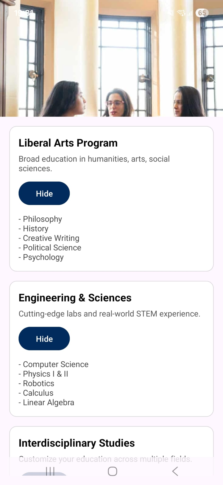
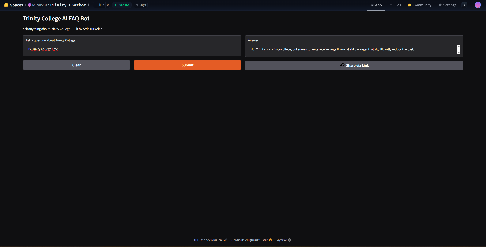

Trinity Project — by Arda Mir Arkin
Early Decision Applicant — Trinity College (Fall 2026)
📘 Overview

This repository showcases the technical projects I developed specifically for my Early Decision application to Trinity College.
My goal is to demonstrate initiative, creativity, and engineering ability as a prospective Bantam interested in Computer Science and Engineering.

I believe in showing, not telling.

🚀 Included Projects
1. Trinity Guide Mobile App (Android)

Status: Ongoing
A student-focused mobile app designed to help prospective Trinity students navigate:

Campus life

Academics

Financial aid

Housing

Important deadlines

Campus safety information

The app will also include, if admitted:

✔ Real-time campus map

✔ Role-based login (Student / Faculty / Parent)

✔ Alerts for grades, deadlines, appointments

✔ Parent notification system (with permission)

  
  
  

2. Trinity AI FAQ Chatbot

Status: Completed
A Python + SentenceTransformer chatbot that answers common questions about Trinity.
Hosted publicly on HuggingFace Spaces.

🔗 Live Demo: https://huggingface.co/spaces/MirArkin/Trinity-Chatbot

🧠 Purpose: Reduce repetitive workload for admissions staff + provide instant responses to common questions.

3. AR Campus Visualization (Future Goal if Admitted)

An augmented-reality visualizer that will allow future Trinity students to:

View campus buildings in 3D

See academic departments

Walk through campus virtually

Integrate academic deadlines + events into AR markers

Link: https://huggingface.co/spaces/MirArkin/Trinity-Chatbot

This project is planned as a passion-driven learning initiative if I become a Bantam.

  
  

📂 Repository Structure
/Trinity-Project
├── Trinity-Guide-App/
├── Trinity-CS-Chatbot/
└── Trinity-Project.pdf

📄 Documentation

All detailed explanations, screenshots, and future plans are included in:
📘 Trinity-Project.pdf (uploaded in this repo)

📬 Contact

Arda Mir Arkin
📧 ardamirarkin35@gmail.com

🌍 Turkey
